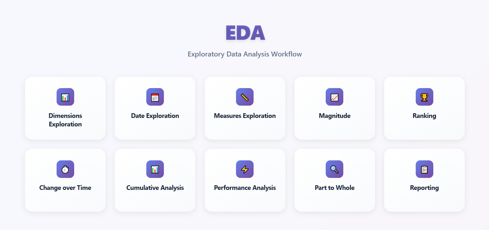
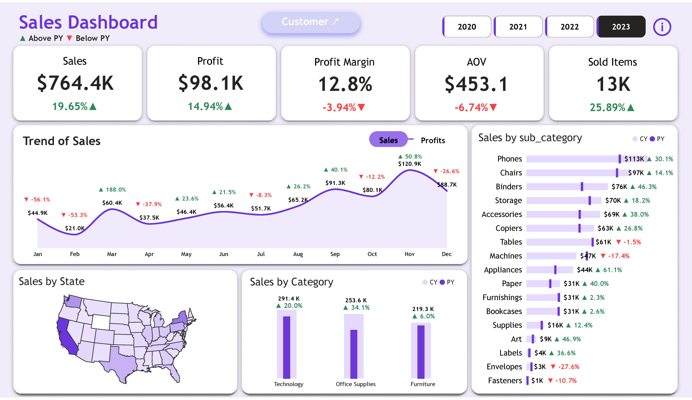
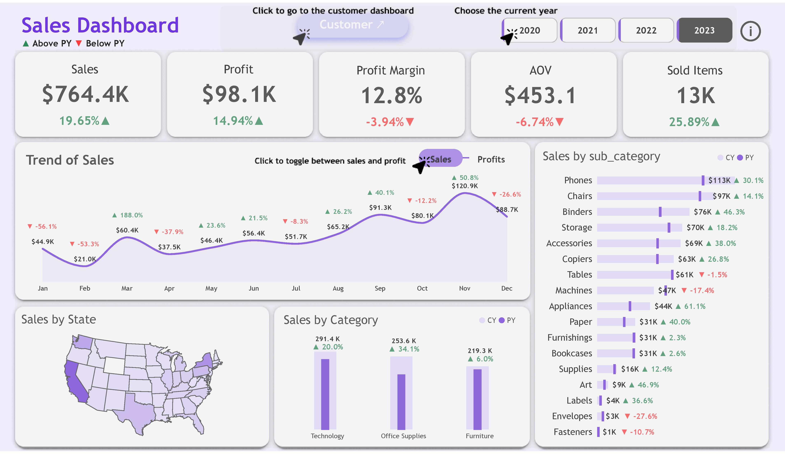
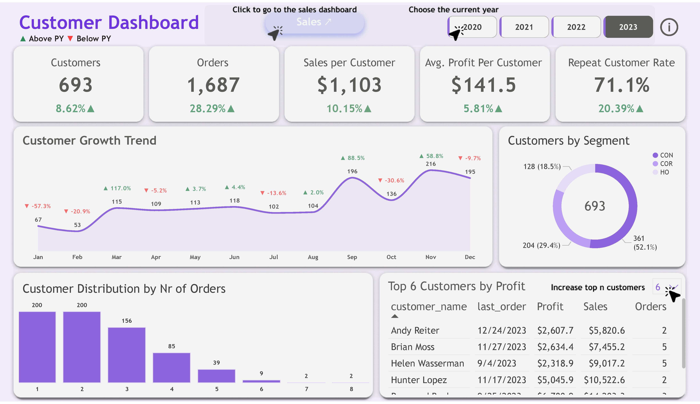

# Power BI Sales & Customer Insights Dashboard 📊

🚀 A complete business intelligence project using SQL and Power BI to explore, clean, and visualize sales and customer data. This project offers key business insights, monthly trends, and strategic recommendations based on historical data.

---

## 🧠 Project Overview

This project demonstrates the end-to-end journey of turning raw sales and customer data into actionable insights using:

- 🧮 SQL for data cleaning, fixing duplicate IDs, and exploratory data analysis (EDA)
- 📊 Power BI for dashboard creation and storytelling
- 🎨 Figma & Draw.io for dashboard design and layout planning

---

## ⚙️ Tools Used

| Tool      | Purpose                      |
|-----------|------------------------------|
| SQL       | Data cleaning, transformation, EDA |
| Power BI  | Dashboard development        |
| Figma     | Wireframing / UI prototyping |
| Draw.io   | Data modeling and diagrams   |

---

## 🔍 Data Cleaning & Preprocessing

- Initial data contained duplicate IDs in dimension tables (Products, Locations)
- Deleting them would have resulted in data loss as the duplicates represented distinct records
- ✅ Solution: Created new unique identifiers via SQL and built cleaned **views** for modeling
- Ensured proper relationships for Power BI import

---

## EDA Workflow Diagram

---

## 📈 Dashboards Created

> 🔗 **[Interact with the live Power BI Dashboard here](https://app.powerbi.com/links/18XtqvyVQ6?ctid=1158e2d5-dc24-41ad-abce-62841076dbde&pbi_source=linkShare&bookmarkGuid=8addbc99-2455-4bbe-b977-90cde491af5f)**

### 1. **Sales Dashboard**

**Highlights:**
- 4th year of revenue growth
- High-performing categories: Technology, Office Supplies
- Margin compression suggests cost control opportunities
- AOV decline suggests opportunity for **upselling / cross-selling**
- Monthly volatility with Q1 slump and March rebound

### 2. **Customer Dashboard**

**Highlights:**
- Rising repeat rate indicates customer satisfaction
- Fall is peak season for customer engagement
- Corporate clients show high profitability
- Top 5 customers generated > $2.5K in profit each

---

## 💡 Insights & Recommendations

### Short-Term (0–3 Months)
- 📉 Recover profit margin: Review pricing & top SKUs
- 📦 Bundle low-AOV items with high-margin products
- 📲 Focus inventory on high-growth categories like Phones, Chairs

### Mid-Term (3–6 Months)
- 🧹 Phase out declining categories (e.g., Envelopes, Machines)
- 🎯 Launch targeted campaigns for each customer segment
- 💵 Introduce cross-sell incentives

### Long-Term (6–12 Months)
- 📈 Expand product lines under Technology and Office Supplies
- 🌍 Target new market segments or geographies
- 📊 Use seasonal trends to optimize Q1 next year

---

## ✍️ Author

**[Ahmed Mohammed Elsayed Mohammed]**  
_Data Analyst | Business Analyst | Power BI Developer_  
🔗 [LinkedIn Profile](https://www.linkedin.com/in/ahmed-mohammed-112637344)

---

## 📜 License

This project is open source and available under the [MIT License](LICENSE).

---
